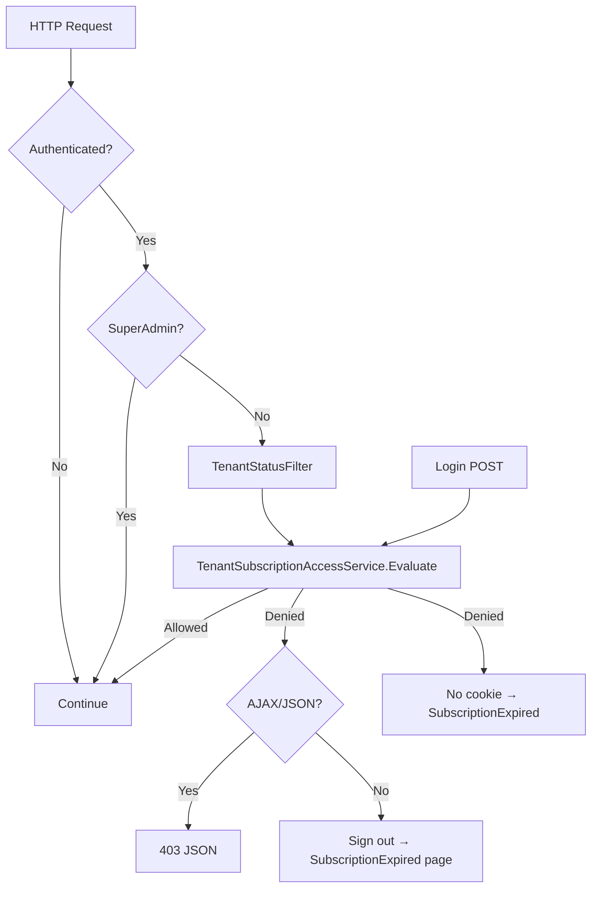

# Subscription Access Audit

**Date:** 2026-07-15  
**Issue:** TCS tenant (Trial, expires Jul 14, 2026) could still access on Jul 15, 2026.

---

## Existing logic (before fix)

| Layer | Location | Behavior |
|-------|----------|----------|
| Login guard | `AccountController.Login` | Checked `Status` + `ExpirationDate < DateTime.UtcNow.Date` |
| Per-request filter | `TenantStatusFilter` | Same comparison; sign-out + redirect to `/Account/Suspended` |
| Dashboard widget | `Home/Index.cshtml` | Displayed stored `Status` only (not computed expiry) |
| SuperAdmin | `TenantsController` | Manual edit/suspend/reactivate; no extend shortcut |

**Not enforced:** `Tenant.IsActive`, payment gateway, grace period (none exists).

---

## Root cause

**Primary:** Expiration used **UTC calendar date** (`DateTime.UtcNow.Date`) while the UI displays a **business calendar date** (Philippines). On July 15 morning (UTC+8), UTC date was still July 14, so `July 14 < July 14` evaluated false and access was allowed.

**Secondary gaps:**
- No centralized subscription service (duplicated logic)
- Stored `Status` never auto-updated to `Expired` when date passes
- Dashboard showed `Trial` even when date-expired
- 5-minute block cache not invalidated on SuperAdmin edits
- Entire `Account` controller exempt from filter (including `ChangePassword`)

---

## Date / time semantics

| Item | Value |
|------|-------|
| Storage | `Tenant.ExpirationDate` — `DateTime?` (date from HTML `type="date"`) |
| Business timezone | `SaaSSettings:BusinessTimeZoneId` — default **`Asia/Manila`** |
| Comparison | **Date-only** in business timezone |
| Inclusive rule | Allowed when `businessToday <= expirationDate` |
| Expired when | `businessToday > expirationDate` OR `Status` is Suspended/Expired OR `!IsActive` |

No grace period (not in schema).

---

## Request flow (after fix)



---

## Access rules (`TenantSubscriptionAccessService`)

**Allow** when: tenant active, not suspended/expired status, business date not past expiration, and (plan or expiration assigned).

**Deny** when: disabled, suspended, status expired, date expired, or trial/active with no plan and no expiration.

**SuperAdmin:** bypasses all tenant subscription checks.

---

## Payment status limitations

No payment gateway, invoices, or auto-renewal in the frozen release. Access is controlled by:

- SuperAdmin-managed `Status`
- `ExpirationDate`
- `IsActive`

Manual extension via SuperAdmin **Extend Subscription** on tenant details.

---

## Security considerations

- Denied login does not issue auth cookie
- Mid-session denial via global filter (2-minute cache, invalidated on SuperAdmin changes)
- AJAX requests receive 403 JSON (no HTML login redirect)
- Expired page shows tenant name/status only — no DB names or IDs
- Operational DB routing only reached after filter allows request

---

## Configuration

`appsettings.json`:

```json
"SaaSSettings": {
  "BusinessTimeZoneId": "Asia/Manila"
}
```
